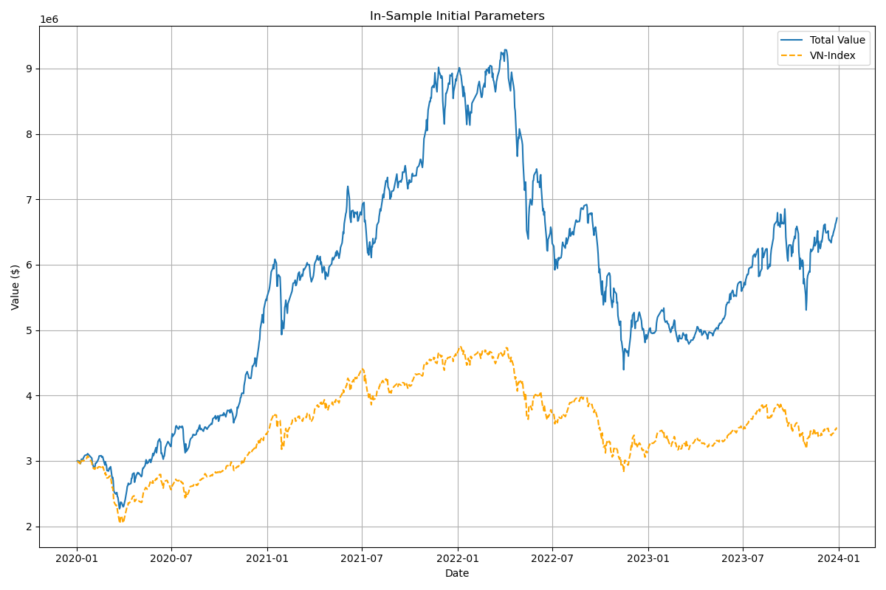

# Abstract
This project evaluates the smart beta strategy for recommending daily stock investments. The strategy integrates technical indicators derived from daily stock prices and financial statement data on a quarterly and yearly basis. Each day, three stocks are selected for purchase, with positions held for a three-month trading period.

# Introduction
This project aims to develop and assess a smart beta strategy for stock selection in the VN100 market by combining technical indicators and financial statement data. The strategy is evaluated based on its ability to recommend the top three daily stocks for investment. Positions are maintained for a three-month trading period to ensure a comprehensive assessment of the strategy’s effectiveness.

## Installation
1. Clone the repository:
2. Navigate to the project directory and navigate to the `src` folder:
3. Install the required packages:
```bash
pip install -r requirements.txt
```

# Data
## Data Collection
There are two types of data which are the financial statement and daily trading data. The data is collected from the `loader.py` file if the data is not available.
## Database Environment
- In order to run the project, you need to have a database environment. 
- Create ```.env``` file and enter your data source configuration with the format
```
HOST=<host or ip>
PORT=<port>
DATABASE=<database name>
USER=<username>
PASSWORD=<password>
```
- source the .env file by the command:
```
source .env
```
## Data Processing
The data is processed when the you run the backtesting and optimization processes. The data is processed in the `processor.py` file. The data is processed in the following steps:
1. Load the data from the csv files, if not available, the data will be collected from the loader.py file.
2. Compute the technical indicators for the daily trading data.
3. Compute the financial ratios for the financial statement data.
# Implementation
We calculate scores for each stock based on the technical indicators and financial ratios. The scores are calculated from a weighted sum of the normalized technical indicators and financial ratios. They are:
- Technical Indicators (Daily Trading Data):
    - RSI (lookback period: 14 days)
    - MACD (short period: 12 days, long period: 26 days, signal period: 9 days)
- Quarterly Financial Ratios:
    - ROE (Return on Equity)
    - Net Margin
    - Debt to Equity
    - Current Ratio
    - Asset Turnover
    - Revenue Growth
    - Quick Ratio
    - Inventory Turnover
- Yearly Financial Ratios:
    - EPS (Earnings Per Share)
    - PE (Price to Earnings)

# Backtesting
- To test the strategy, we will use the backtesting module
```python
python backtest.py
```
- You can change the setting in the `parameter/backtesting_params.json` file. The parameters are:
```json
{
    "in_sample_start_date" : "2020-01-01",
    "in_sample_end_date" : "2023-12-31",
    "out_sample_start_date" : "2024-01-01",
    "out_sameple_end_date" : "2024-12-31",
    "initial_balance": 3000000,
    "transaction_fee": 0.0035
}
```
- The current initial weights for the scoring function are in `parameter/initial_params.json` file. The parameters are:
```json
{
    "RSI": 0.2,
    "MACD_histogram": -0.5,
    "ROE": 0.5,
    "Net Margin": 0.5,
    "Debt to Equity": 0.5,
    "Current Ratio": 0.5,
    "Asset Turnover": 0.5,
    "Revenue Growth": 0.5,
    "Quick Ratio": 0.5,
    "Inventory Turnover": 0.5,
    "EPS": 0.1,
    "PE": 0.1
}
```
- Result:


- Report: [link](./doc/BACKTESTING_REPORT.pdf)

# Optimization
- Optuna is used for the optimization process. More detail of optuna can be found [here](https://optuna.org/)
- The objective function maximizes the Sharpe ratio while minimizing maximum drawdown.
- The setting for the optimization process is in the `parameter/optimization_params.json` file. The parameters are:
```json
{
    "in_sample_start_date" : "2020-01-01",
    "in_sample_end_date" : "2023-12-31",
    "out_sample_start_date" : "2024-01-01",
    "out_sameple_end_date" : "2024-12-31",
    "initial_balance": 3000000,
    "transaction_fee": 0.0035,
    "n_trials": 100
}
```
- Run the optimization process:
```python
python optimizer.py
```
- The optimized parameters is stored in `parameter/optimized_params.json`
- The current optimized parameters are:
```json
{
    "RSI": 0.2712847478558255,
    "MACD_histogram": -0.5729581824897981,
    "ROE": 0.7524039314794783,
    "Net Margin": 0.12566586843968383,
    "Debt to Equity": 0.6181453827100141,
    "Current Ratio": 0.8079692273253916,
    "Asset Turnover": 0.4858660237089318,
    "Revenue Growth": 0.7028858281315148,
    "Quick Ratio": 0.29015339861805145,
    "Inventory Turnover": 0.4946265231258303,
    "EPS": 0.0004474337496186212,
    "PE": 0.1887945809807362
}
```

- Result:


- Report: [link](./doc/OPTIMIZATION_REPORT.pdf)

# Out-of-sample Backtesting

- To validate the performance of the optimized parameters, we will conduct an out-of-sample backtesting process. The out-of-sample backtesting process is done in the `validator.py` file.
```bash
python validator.py
```
- The results of the out-of-sample backtesting process will be stored in the `results` folder. 

Result:


# Conclusion
The smart beta strategy using technical indicators and financial statement data for stock selection has delivered promising results in the VN100 market. Out-of-sample backtesting for 2024 highlights its strong performance:

- **Annual return**: 24.18%, outperforming the VNINDEX benchmark of 12.03%

- **Sharpe ratio**: 0.84, compared to the VNINDEX benchmark of 0.69

However, the current implementation does not fully replicate real trading conditions, as it does not account for slippage. Additionally, a more efficient allocation method should be explored instead of equally distributing investment across the top three selected stocks.

# References
- [1] Khoi Ta, *Smart Beta Strategy*, [Link](https://github.com/algotrade-research/smart-beta/)
- [2] Algotrade. *Weighting Methods Used in Smart-Beta Strategy*. [Link](https://hub.algotrade.vn/knowledge-hub/weighting-methods-used-in-smart-beta-strategy/)